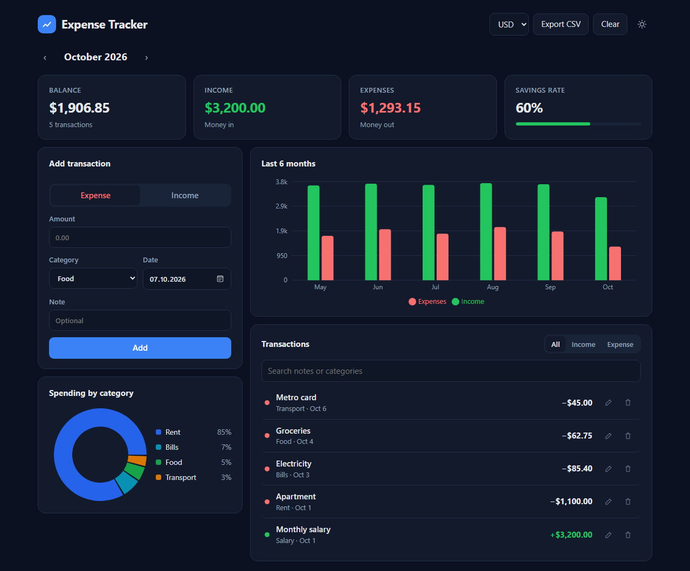

# Expense Tracker


A personal finance app for tracking income and expenses, built with **React 19**, **TypeScript** and **Vite**.

**Live demo:** https://yusufky56.github.io/expense-tracker/



## Features

- Add, edit and delete income and expense entries
- Monthly view with balance, income, expenses and savings rate
- Spending by category (donut chart) and a six-month income vs. expense bar chart
- Search and filter the transaction list
- Export everything to CSV
- Light and dark theme, four currencies (USD, EUR, TRY, GBP)
- Data is saved in `localStorage`, so it stays in the browser and needs no account
- Responsive layout that works on phones
- Sample data on the first visit so the charts are not empty

## Tech

| | |
|---|---|
| UI | React 19 with hooks, TypeScript in strict mode |
| Charts | Recharts |
| Build | Vite |
| Tests | Vitest |
| Lint | Oxlint |
| CI/CD | GitHub Actions: lint, test, build, then deploy to GitHub Pages |

Business logic lives in plain functions in [`src/lib/finance.ts`](src/lib/finance.ts) and is unit tested separately from the UI. Money is added up in cents so totals like `0.1 + 0.2` don't drift.

## Getting started

```bash
npm install
npm run dev      # http://localhost:5173
npm test         # unit tests
npm run build    # production build in dist/
```

## Project structure

```
src/
├── App.tsx                  # Page layout and state wiring
├── components/
│   ├── SummaryCards.tsx
│   ├── TransactionForm.tsx
│   ├── TransactionList.tsx
│   └── Charts.tsx
├── hooks/useTransactions.ts # State + persistence
├── lib/
│   ├── finance.ts           # Totals, grouping, monthly series, CSV
│   ├── finance.test.ts
│   └── storage.ts           # localStorage with validation, demo data
└── types.ts
```

## License

[MIT](LICENSE)
